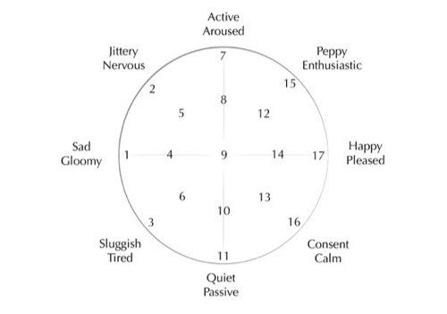

# Shamanic Meditation Listening Study 3.
## Session questionnaire 
## Part 1: Before listening

Before you start the session, please indicate that you have met the conditions needed for the listening part:

- [ ] my environment is comfortable, safe and undisturbed
- [ ] my body is not concentrating on digestion i.e. I haven't eaten for the last two hours
- [ ] I will use headphones for the listening part

1. Session number (if this is your first session in this study please write 1, if it is the second, please write 2, etc.):

2. Have you used any mood altering substances including caffeine or alcohol in the last few hours?
- [ ] Yes
- [ ] No  
If yes, please specify (optional):

3. How focused do you feel now? Please indicate this with a number between 0 and 100, where 0 is not focused and 100 is focused:

4. Choose a number from the circle below to indicate how you feel:
&nbsp;

## Part 2: Listening
Find a comfortable place where you will not be disturbed for 20-30 minutes. Sit or lay down, relax all your muscles, especially in your tongue and behind your eyes and think about a personal question you would like to seek clarity on. You will not have to share this question in the survey. Examples of questions could be: "Why is my relationship with X and Y difficult?", or, "How can I encourage myself to eat a healthy diet?"

A soundscape can be interpreted as a journey to the middle of an imaginary forest through several layers called levels. A soundscape starts outside the forest and moves gradually inwards and at the end when the soundscape reaches the middle of the forest, a 'call back' with the drumming suddenly slowing down and changing rhythm will ask you to return to the outside of the forest. The drumming in the levels when moving towards the middle of the forest become slower, more repetitive, less variable and slightly louder. 

When you reach the end of the journey, open your eyes and carry on with the survey's Part 3: After listening. 

While listening, occasionally remind yourself of the question that you would like to seek clarity on. As the music towards the end is slightly lauder, please adjust your volume now to a comfortable position. Also, please make sure your device does not pause the music when it goes into sleep mode.

While listening, try to focus on the most repetitive parts of the music, the computer generated drumming. As mentioned earlier, they will gradually become more stable to help your meditation. Consider this drumming as your anchor. Surrender your attention to this anchor. Whenever your mind wanders off to think about the past or the future, try to reattach your attention to your anchor. Do not be harsh with yourself, this is very difficult. Be patient, "practice makes the master".

After a while (usually around 10-15 minutes) you might start seeing internal visual, dreamlike imageries. If you like what you see, if you think what you see can provide you with interesting insights, then some of your attention now should start slowly be allocated to sharpening and maintaining these visuals. By this time your anchor should be stable, so you can let go and follow your intuitions. Try not to analyse the experience while experience it, this usually interrupts the experience. You can do this later, after the listening part. 

Ready?

Put your headphones on, select one of the soundscapes below (please indicated which one you selected).  

Press play, close your eyes and let the music sink inwards.

- [ ] soundscape 1: computer generated drumming and a few sound effects [https://tedor.bandcamp.com/track/k](https://tedor.bandcamp.com/track/k) (30 minutes long)

- [ ] soundscape 2: computer generated drumming and more sound effects + my drumming on an acoustic frame drum [https://tedor.bandcamp.com/track/jester-original](https://tedor.bandcamp.com/track/jester-original) (20 minutes long)

- [ ] soundscape 3: computer generated drumming and more sound effects + my drumming on an acoustic frame drum + binaural beats [https://tedor.bandcamp.com/track/jester-binaural-beats-version](https://tedor.bandcamp.com/track/jester-binaural-beats-version) (20 minutes long)

## Part 3: After listening
Thank you for listening to the soundscape. Please address the following questions. 

5. How focused do you feel now? Please indicate this with a number between 0 and 100, where 0 is not focused and 100 is focused:

6. Choose a number from the circle below to indicate how you feel:
&nbsp;

7. In which part of the soundscape were you the most focused? Please indicate on the spectrum below or write it down in your own words. 

 
&nbsp;&nbsp;&nbsp; start -------------------------------------------------------------------------------------------- end
  

8. Did you have visual imagery?
- [ ] Yes
- [ ] No

9. Please describe your experience in words and/or drawings on the next empty page. For your drawings you could use any number of colours, words, detailed or not detailed forms and draw in any style that helps you remember your journey the most. An excellent way to remember is to close your eyes and imagine or remember the monotone drumming in your head that you were listening to.

Many thanks for completing the session. Please keep your filled in surveys until the end of the study i.e. until the end of your participation and then send them to me via email or post which we can discuss in our personal conversations before/during or after your participation. 

Krisztián Hofstädter

